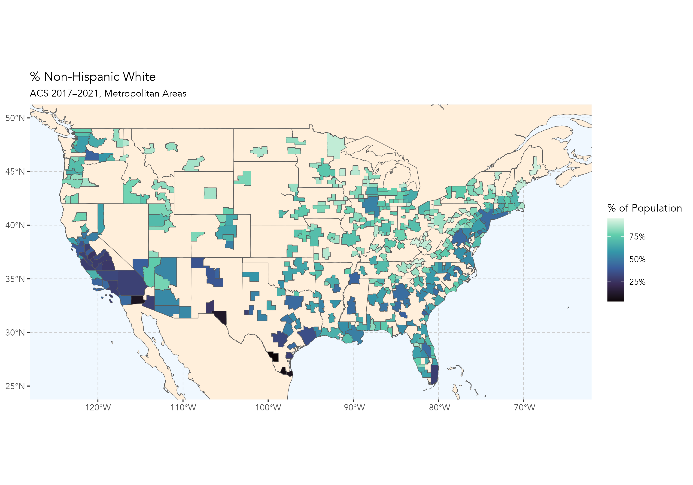
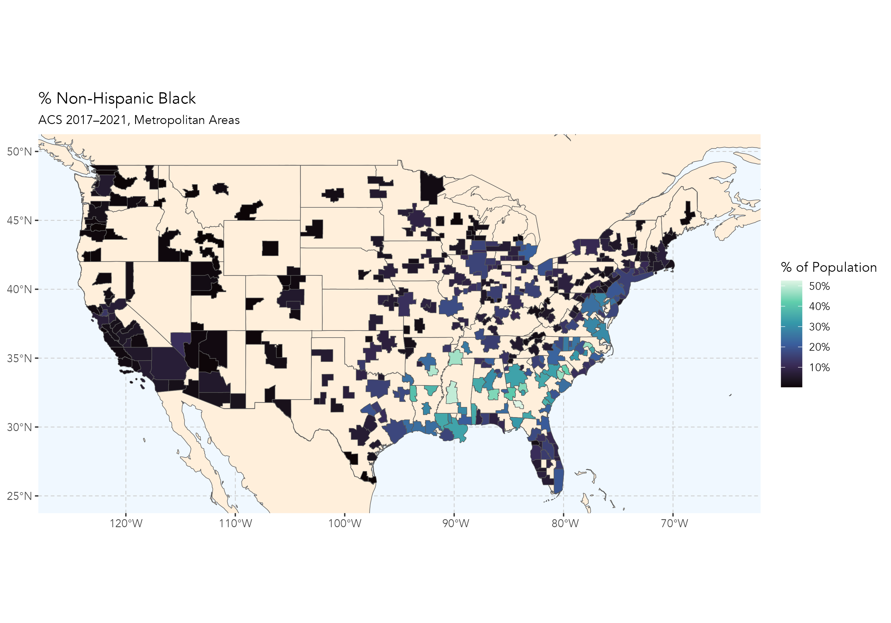
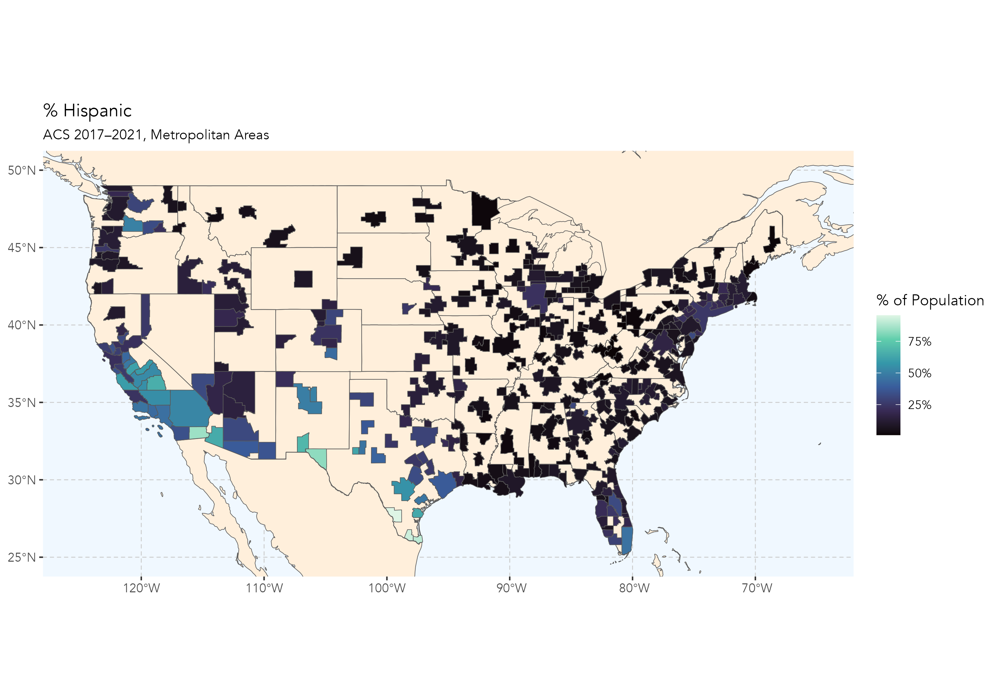
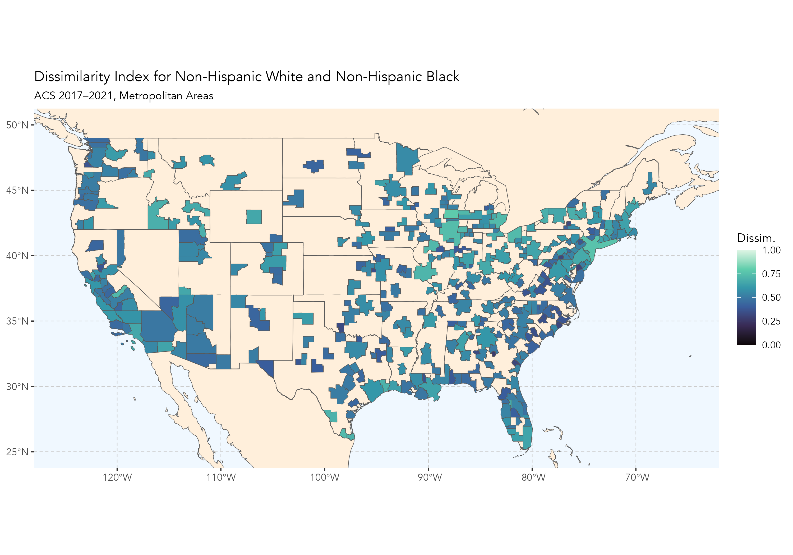
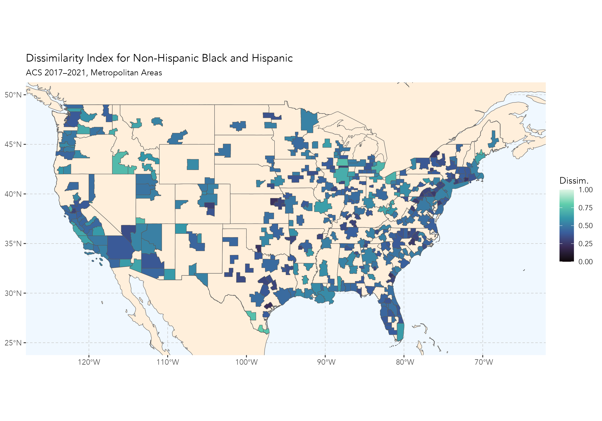

# group-maps

## Description

This project generates choropleth maps showing racial/ethnic group composition and dissimilarity across U.S. metropolitan areas, based on American Community Survey (ACS) data.

## Overview

The script `run_group_maps.R` produces two main types of maps:
- **Population Percentage Maps**: Share of total population identifying as:
  - Non-Hispanic White
  - Non-Hispanic Black
  - Hispanic (any race)
- **Dissimilarity Index Maps**: Segregation between:
  - Non-Hispanic White vs. Non-Hispanic Black
  - Non-Hispanic White vs. Hispanic
  - Non-Hispanic Black vs. Hispanic

All maps are saved as high-resolution PNG files in the `output/` directory.

## Data Sources

- **ACS 2017–2021 5-Year Estimates (Table B03002)**  
  Retrieved directly using the `{tidycensus}` R package.
  
- **Tract-to-CBSA Crosswalk**  
  File: `data/enclave_tract1.csv`  
  Compiled by *The Washington Post* from block-level redistricting data.  
  License: Creative Commons Attribution–NonCommercial–ShareAlike 4.0 (CC BY-NC-SA 4.0)

## Requirements

This project uses the following R packages:

- `tidycensus`
- `tidyverse`
- `tigris`
- `sf`
- `ggspatial`
- `rnaturalearth`
- `rnaturalearthdata`
- `tidygeocoder`
- `maps`
- `ggrepel`

To install all required packages:

```r
install.packages(c(
  "tidycensus", "tidyverse", "tigris", "sf", "ggspatial",
  "rnaturalearth", "rnaturalearthdata", "tidygeocoder", 
  "maps", "ggrepel"
))
```
                  
## Usage

1. **Set your Census API key** (if not already set up):

    ```r
    library(tidycensus)
    census_api_key("YOUR_API_KEY", install = TRUE)
    ```

2. **Run the script** from the project root:

    ```r
    source("run_group_maps.R")
    ```

3. **Output files** will be saved in the `output/` directory:

    - `pct_nhw.png`
    - `pct_nhb.png`
    - `pct_hisp.png`
    - `dissim_nhw_nhb.png`
    - `dissim_nhw_hisp.png`
    - `dissim_nhb_hisp.png`
    
    
```
group-maps/
├── data/
│   └── enclave_tract1.csv         	# Tract-to-CBSA crosswalk from Washington Post
├── output/
│   ├── pct_nh_white.png		# % Non-Hispanic White
│   ├── pct_nh_black.png 		# % Non-Hispanic Black
│   ├── pct_hisp.png                   	# % Hispanic
│   ├── plot_nhw_nhb.png          	# Dissimilarity: NH White vs NH Black
│   ├── plot_nhw_hisp.png         	# Dissimilarity: NH White vs Hispanic
│   └── plot_nhb_hisp.png          	# Dissimilarity: NH Black vs Hispanic
└── run_group_maps.R               	# Main script to generate all maps
```

## Example Output

> Example map outputs from the ACS 2017–2021 data:

### Population Percentage Maps

| % Non-Hispanic White | % Non-Hispanic Black | % Hispanic |
|----------------------|----------------------|------------|
|  |  |  |

### Dissimilarity Index Maps

| NH White vs NH Black | NH White vs Hispanic | NH Black vs Hispanic |
|----------------------|----------------------|-----------------------|
|  |  |  |

    
   